#  MJ古风系列设计

### 1.项目概述

​		在本项目中，学生将通过Midjourey，学习和运用垫图imagine prompt与细微调整Vary (Subtle)功能。从基础的prompt编辑、上传图片链接到后缀词编辑，再到应用微调画面内容，学生将逐步掌握这些工具的基本实现方式。

### 2.项目目的

- 通过完成项目，熟练掌握Midjourey的垫图模式，包括prompt编写、正确上传图片和后缀词的使用与权重。
- 学生将了解并应用Midjourey与Photoshop结合，通过MJ生成图片，再到PS入深入调整画面。

### 3.实施环境

- **软件要求：** Midjourey。
- **硬件要求：** 笔记本电脑或台式电脑，配置要求能够流畅运行Midjourey。

### 4.项目效果

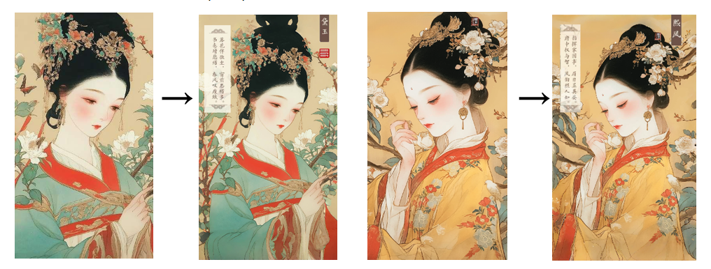

###### 5.项目操作

#### 操作步骤

#### 1、选择一张或多张参考图，随后点击输入框的”+“号，点击”上传文件“，然后回车，把图片上传到MJ

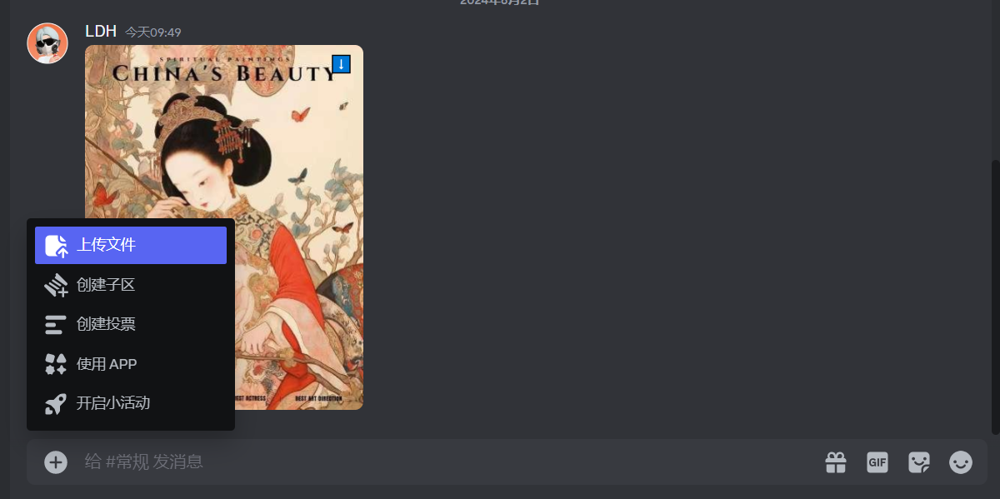

- 此次使用的参考图如下

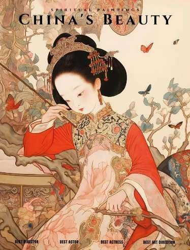

#### 2、点击上传的照片，下方会显示三行小字，点击”复制垫图网址（自动加逗号）“

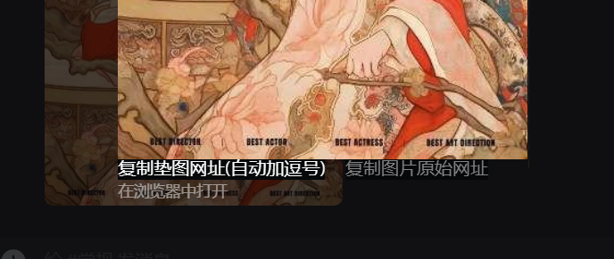

#### 3、在下方框中输入”/“，随后会弹出选择界面，点击”imagine prompt”

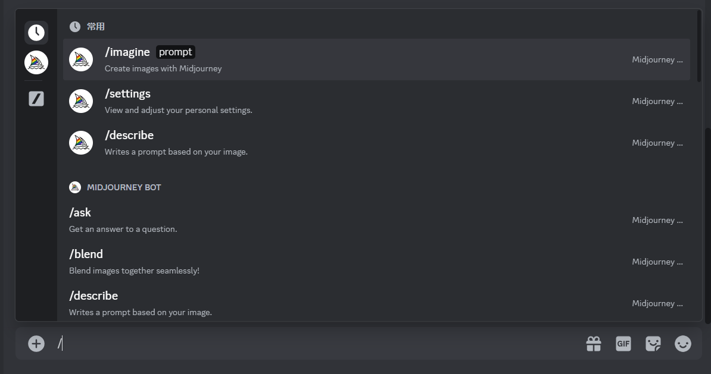

- 把上方复制过的图片链接粘贴到此框，然后空格，再输入prompt，然后回车

- **prompt：**Chinese Painting,Paper, the style of Song Dynasty meticulous painting, with a bird and flowers, white flowers, light green leaves, The dominant color is a mix of light brown light blue, 1girl, bug, black hair, solo, butterfly, branch, jewelry, chinese clothes, hair ornament, earrings, long sleeves, holding, flower, red lips, makeup, dress, cover, updo, black eyes --s 250 --niji 6

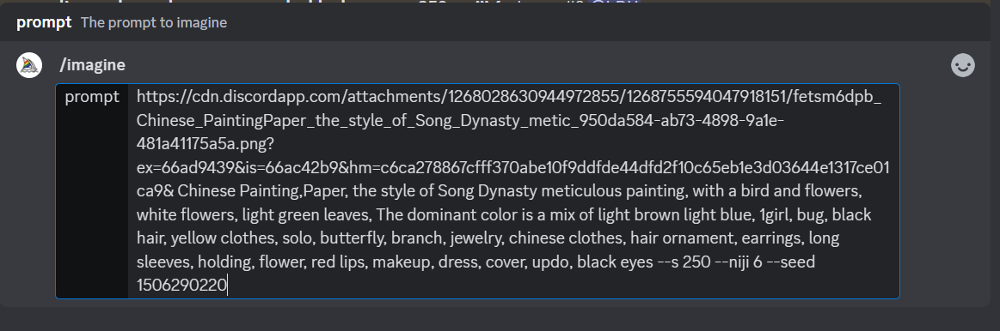

#### 2、观察图片，再调整prompt，按下方”"按钮，修改并添加细节

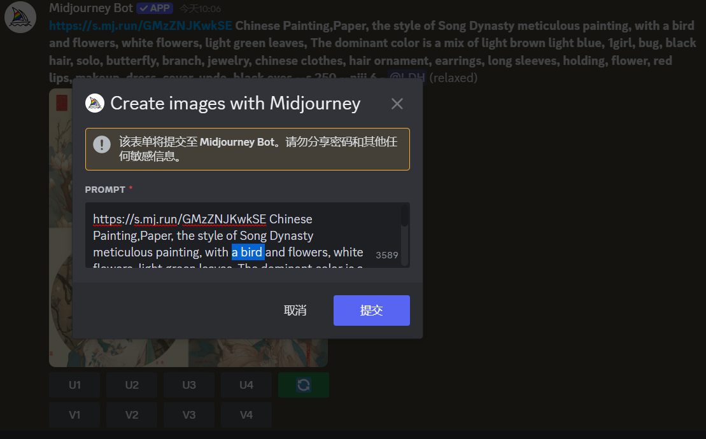

- 我觉得上一张里的“bird”在画面比较突兀，所以去掉了，添加了新的肢体语言，”look down and run your hand over your cheek低头抚颊”以及目标人物的经典形态表现“ calm, slightly frowning紧促眉梢”

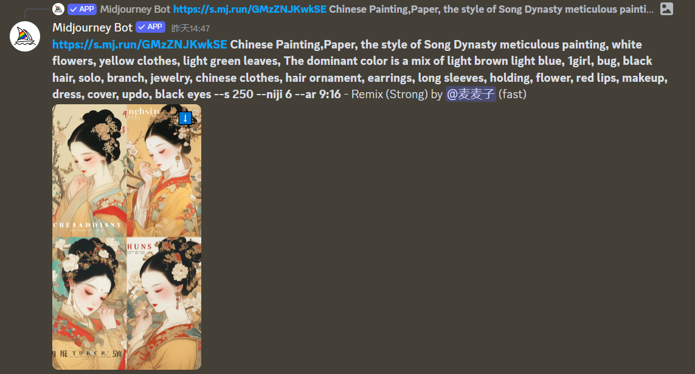

- 经过几次“V”按钮的迭代，最后“U”按钮输出一张比较符合预想的图像

#### 3、点击“Vary (Subtle)"通过关键词微调图像细节，通过添加后缀--ar+数值调整尺寸，案例海报尺寸为9：16

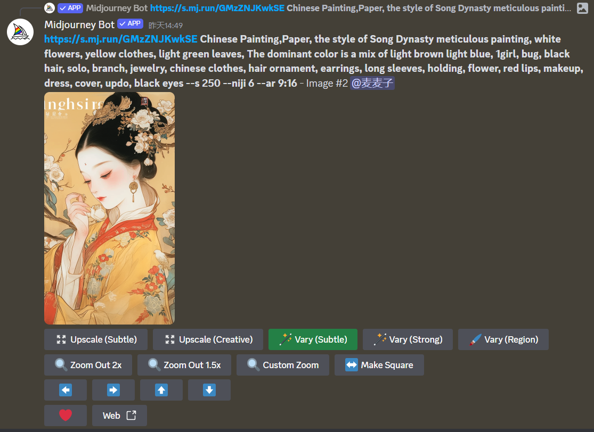

#### 4、多经过几次roll看到合适的图像按U输出，再针对画面缺陷进行微调，可通过调整seed值来达到效果

- 右键点击原图，在”更多反映”中添加envelop,发送seed到私信

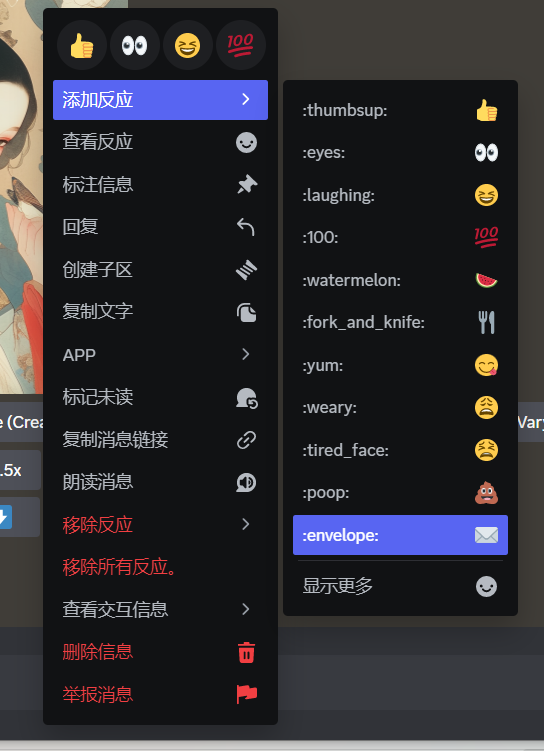

- 随后在左侧的服务区点击最上面的图标，这时候种子数已经发送过来了，复制seed值

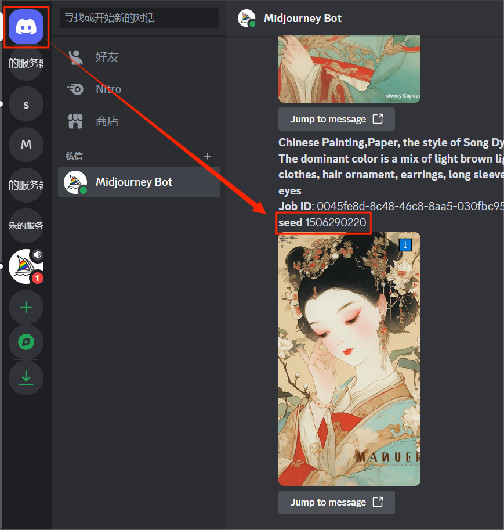

#### 4、替换关键词，给她换成黄色的衣服，添加“yellow clothes”，并在末尾添加--seed+数值重新生成。

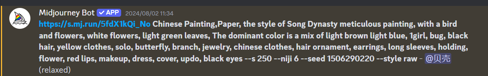

#### 5、生成图片后，觉得两张图片的效果比较符合预期，可以使用/BLENDER混图模式，输入框中输入“/”回车，上传图片（PNG或JPG）

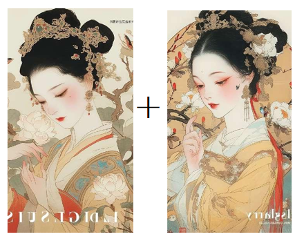

#### 6、等待生成完成，选择合适的图片，按U输出后导入Phtotshop进行修改和完善，点击左侧裁剪工具，拉宽图像尺寸，预留文字空间，再点击编辑的内容识别填充

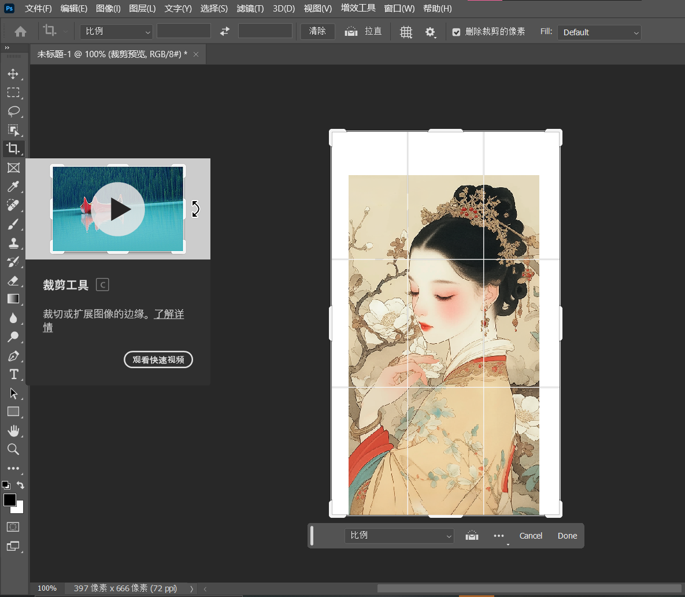

#### 7、输入文字图案完善海报

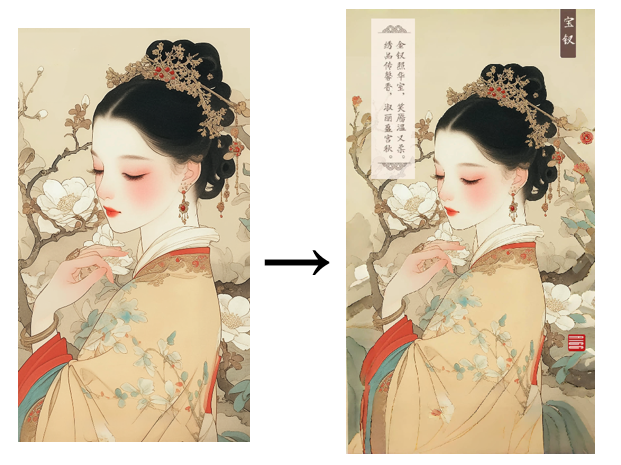

